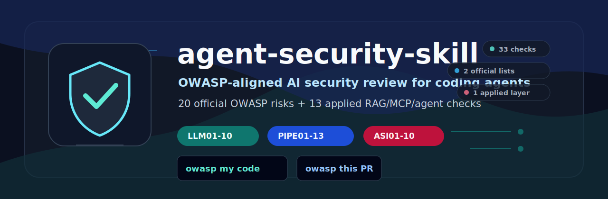

<div align="center">



# 🛡️ agent-security-skill

**One file. 20 official OWASP AI risks + 13 applied gap checks for coding agents.**

[](https://opensource.org/licenses/MIT)
[](https://owasp.org)
[](#installation)
[](https://github.com/olanokhin/agent-security-skill/pulls)

<br/>

```
Drop AI_SECURITY.md into your project root.
Your coding agent starts reviewing AI code against OWASP-aligned checks.
Today. While you learn the list at your own pace.
```

[**⬇️ Get the Skill File**](./AI_SECURITY.md) · [**See the Full Checklist**](#the-checks) · [**Quick Install**](#installation)

</div>

---

## The Problem

OWASP now separates AI application security across LLM and agentic application risks. This skill adds applied checks for the RAG, MCP, and orchestration gaps that show up in real code.

Most engineers know **3**.

```
What you know:         ███░░░░░░░░░░░░░░░░░░░░░░░░░░░░░░  3 / 33
What this skill checks:█████████████████████████████████  33 / 33
```

The gap between those two bars is where incidents happen.

---

## The Three Layers

```
┌─────────────────────────────────────────────────────────┐
│  🔴  LAYER 1 — THE MODEL          OWASP LLM 2025        │
│      What your LLM does                                  │
│      Prompt injection · Data poisoning · Unbounded use   │
├─────────────────────────────────────────────────────────┤
│  🟠  LAYER 2 — APPLIED GAPS       Author checklist      │
│      What your RAG system does                           │
│      Tool poisoning · KB leakage · Regression evals      │
├─────────────────────────────────────────────────────────┤
│  🔥  LAYER 3 — THE AGENT          OWASP Agentic 2026    │
│      What your system becomes                            │
│      Goal hijack · Tool misuse · Rogue agents            │
└─────────────────────────────────────────────────────────┘
```

Most tutorials cover Layer 1, item 1.  
This skill uses the official OWASP LLM 2025 and Agentic 2026 lists as the foundation, then adds an author-maintained applied checklist for gaps that show up in real RAG, MCP, and orchestration code.

---

## How to Use

This repo ships:

- `AI_SECURITY.md` — the full security instruction file.
- `AGENTS.md` — a small universal entrypoint that imports the skill.
- `skills/agent-security/SKILL.md` — portable skill format for runtimes that support skill folders.
- `examples/unsafe.py` — intentionally vulnerable AI code.
- `examples/report.md` — example output from `owasp my code`.

Install it by making your coding agent load that file as persistent project instructions. After installation, use it in two ways:

1. **Automatic guardrail** — when your agent writes or edits LLM, RAG, MCP, tool, or agent code, it should apply the relevant `LLM`, `PIPE`, and `ASI` checks.
2. **Explicit review** — ask your agent: `owasp my code`
3. **Pre-merge audit** — ask your agent: `owasp this PR`

The file is guidance, not a runtime scanner. It works best when your agent is reviewing code, planning changes, or editing AI-related paths.

These short prompts mean: review the current file, diff, or PR against `LLM01-LLM10`, `PIPE01-PIPE13`, and `ASI01-ASI10`, then report `CRITICAL` and `HIGH` findings first.

> Report quality depends on the LLM model, agent runtime, available context, and files the agent can inspect. Treat findings as security review assistance, not a replacement for human AppSec review.

---

## Try It

After installing the skill, ask your agent:

```text
owasp examples/unsafe.py
```

It should produce findings similar to [examples/report.md](./examples/report.md).

---

## Official OWASP Sources Used

**Core risk lists**
- [OWASP Top 10 for LLM Applications 2025](https://genai.owasp.org/resource/owasp-top-10-for-llm-applications-2025/)
- [OWASP Top 10 for Agentic Applications 2026](https://genai.owasp.org/resource/owasp-top-10-for-agentic-applications-for-2026/)

**Applied guidance used to build the `PIPE` checks**
- [LLM Prompt Injection Prevention Cheat Sheet](https://cheatsheetseries.owasp.org/cheatsheets/LLM_Prompt_Injection_Prevention_Cheat_Sheet.html)
- [RAG Security Cheat Sheet](https://cheatsheetseries.owasp.org/cheatsheets/RAG_Security_Cheat_Sheet.html)
- [AI Agent Security Cheat Sheet](https://cheatsheetseries.owasp.org/cheatsheets/AI_Agent_Security_Cheat_Sheet.html)
- [MCP Security Cheat Sheet](https://cheatsheetseries.owasp.org/cheatsheets/MCP_Security_Cheat_Sheet.html)
- [Secure AI Model Ops Cheat Sheet](https://cheatsheetseries.owasp.org/cheatsheets/Secure_AI_Model_Ops_Cheat_Sheet.html)
- [Secure Coding with AI Cheat Sheet](https://cheatsheetseries.owasp.org/cheatsheets/Secure_Coding_with_AI_Cheat_Sheet.html)
- [Agentic Threats Navigator](https://genai.owasp.org/resource/owasp-gen-ai-security-project-agentic-threats-navigator/)
- [HITL Dialog Forging / Lies-in-the-Loop](https://owasp.org/www-community/attacks/Lies_in_the_Loop)

---

## Installation

Run the commands from your project root.

### Claude Code native skill
```bash
mkdir -p .claude/skills
curl -fsSL https://codeload.github.com/olanokhin/agent-security-skill/tar.gz/main | tar -xzf - -C .claude/skills --strip-components=2 agent-security-skill-main/skills/agent-security
```
Then ask Claude Code:
```text
/agent-security owasp my code
```

Claude Code loads project skills from `.claude/skills/<skill-name>/SKILL.md`.

### Codex app native skill
```bash
mkdir -p .agents/skills
curl -fsSL https://codeload.github.com/olanokhin/agent-security-skill/tar.gz/main | tar -xzf - -C .agents/skills --strip-components=2 agent-security-skill-main/skills/agent-security
```
Then start a new Codex chat and ask:
```text
$agent-security owasp my code
```

Codex app loads project skills from `.agents/skills/<skill-name>/SKILL.md`.

### Claude Code instruction-file fallback
```bash
curl -fsSL -O https://raw.githubusercontent.com/olanokhin/agent-security-skill/main/AI_SECURITY.md
printf '\n# AI Security\n@AI_SECURITY.md\n' >> CLAUDE.md
```
Use this if you prefer project instructions over native skills.

### Cursor
```bash
mkdir -p .cursor/rules
curl -fsSL -o .cursor/rules/ai-security.mdc https://raw.githubusercontent.com/olanokhin/agent-security-skill/main/AI_SECURITY.md
```
For older Cursor setups, copying the file to `.cursorrules` can still work, but `.cursor/rules/*.mdc` is the cleaner project-rules layout.

### GitHub Copilot / VS Code
```bash
mkdir -p .github/instructions
curl -fsSL -o .github/instructions/ai-security.instructions.md https://raw.githubusercontent.com/olanokhin/agent-security-skill/main/AI_SECURITY.md
```

### Windsurf
```bash
curl -fsSL -o AI_SECURITY.md https://raw.githubusercontent.com/olanokhin/agent-security-skill/main/AI_SECURITY.md
printf '\n# AI Security\n@AI_SECURITY.md\n' >> .windsurfrules
```

### Universal fallback
```bash
curl -fsSL -O https://raw.githubusercontent.com/olanokhin/agent-security-skill/main/AI_SECURITY.md
curl -fsSL -O https://raw.githubusercontent.com/olanokhin/agent-security-skill/main/AGENTS.md
```
Use this when your agent supports `AGENTS.md` as a shared instruction file.

### Portable skill format
```bash
mkdir -p skills
curl -fsSL https://codeload.github.com/olanokhin/agent-security-skill/tar.gz/main | tar -xzf - -C skills --strip-components=2 agent-security-skill-main/skills/agent-security
```
Use this when your agent runtime supports a generic `skills/<name>/SKILL.md` layout. For Claude Code, use `.claude/skills`; for Codex app, use `.agents/skills`.

### Verify Installation
Ask your agent:
```text
Which AI security instruction file did you load? List the 5 checks I cannot skip.
```
Expected answer should mention `AI_SECURITY.md` or the native instruction file you installed, plus `LLM01`, `PIPE01`, `LLM06`, `ASI09`, and `ASI10`.

---

## What It Looks Like in Practice

You ask:
```text
owasp my code
```

The agent reviews AI-related code. If you wrote:
```python
prompt = f"Summarize this document: {user_input}"
response = client.messages.create(model="claude-3", messages=[{"role": "user", "content": prompt}])
```

It flags:
```
🚨 LAYER 1 · LLM01 · HIGH
Location: summarize.py:12
Issue: Raw user input concatenated directly into prompt string
Fix: Use structured message roles — move user_input to {"role": "user"} message
```

You learn what LLM01 is.  
The agent already caught it.

---

## The Checks

<details>
<summary><strong>🔴 Layer 1 — The Model · OWASP LLM Top 10 2025</strong></summary>

| Code | Name | What it means |
|------|------|---------------|
| LLM01 | Prompt Injection | User input hijacks model behavior |
| LLM02 | Sensitive Information Disclosure | Model or app exposes sensitive information |
| LLM03 | Supply Chain | Compromised models, datasets, platforms, or dependencies |
| LLM04 | Data and Model Poisoning | Manipulated training, fine-tuning, or embedding data |
| LLM05 | Improper Output Handling | Unvalidated output reaches downstream systems |
| LLM06 | Excessive Agency | Too many permissions, too little control |
| LLM07 | System Prompt Leakage | System instructions exposed or abused |
| LLM08 | Vector and Embedding Weaknesses | RAG/vector stores leak or retrieve unsafe data |
| LLM09 | Misinformation | False or misleading outputs drive bad decisions |
| LLM10 | Unbounded Consumption | Unrestricted use causes cost, abuse, or DoS |

</details>

<details>
<summary><strong>🟠 Layer 2 — Applied Gaps · Author Checklist</strong></summary>

These are practical implementation checks maintained by this project. They are not a separate official OWASP Top 10; they map the official risks to code-review failure modes that are easy to miss.

| Code | Name | Maps to |
|------|------|---------|
| PIPE01 | External Content Prompt Injection | LLM01, ASI01 |
| PIPE02 | Retrieval Authorization & Tenant Isolation | LLM02, LLM08, ASI03 |
| PIPE03 | RAG Ingestion Poisoning & Provenance | LLM04, LLM08 |
| PIPE04 | Knowledge Base Leakage & Source Redaction | LLM02, LLM08 |
| PIPE05 | Tool/MCP Poisoning & Manifest Trust | LLM03, LLM06, ASI02, ASI04 |
| PIPE06 | Insecure Pipeline Orchestration | LLM05, ASI08 |
| PIPE07 | Non-Deterministic Critical Decisions | LLM09 |
| PIPE08 | Action/Approval Binding | LLM06, ASI09 |
| PIPE09 | Automated Social Engineering | LLM06, ASI09 |
| PIPE10 | API Access Control Parity | LLM02, ASI03 |
| PIPE11 | Data Retention & Log Injection | LLM02, LLM10 |
| PIPE12 | Security Regression Evals | LLM01, LLM05, ASI01, ASI02 |
| PIPE13 | Hallucination-Driven Exploits | LLM03, LLM05, LLM09 |

</details>

<details>
<summary><strong>🔥 Layer 3 — The Agent · OWASP Top 10 for Agentic Applications 2026</strong></summary>

| Code | Name | What it means |
|------|------|---------------|
| ASI01 | Agent Goal Hijack | Data in context rewrites the agent's mission |
| ASI02 | Tool Misuse | Legitimate tools are bent into unsafe actions |
| ASI03 | Identity & Privilege Abuse | Agent acts with excessive or wrong authority |
| ASI04 | Agentic Supply Chain Vulnerabilities | Runtime components, tools, or dependencies are poisoned |
| ASI05 | Unexpected Code Execution | Generated code runs outside the sandbox |
| ASI06 | Memory & Context Poisoning | Inject false facts into agent memory or context |
| ASI07 | Insecure Inter-Agent Communication | Spoofed or untrusted agent messages misdirect workflows |
| ASI08 | Cascading Failures | One bad signal spreads through automated workflows |
| ASI09 | Human-Agent Trust Exploitation | Polished agent output tricks human operators |
| ASI10 | Rogue Agents | Agents deviate from intended function or scope |

</details>

---

## The 5 You Cannot Skip

If you're auditing manually, start here:

```
LLM01  Prompt Injection          →  attacker controls your model
PIPE01 External Prompt Injection →  poisoned PDF = same as direct attack  
LLM06  Excessive Agency          →  least privilege. always.
ASI09  Human-Agent Trust Exploit →  HITL that can be faked isn't HITL
ASI10  Rogue Agents              →  can you kill it? if no — don't ship it
```

---

## Why the Applied Layer Exists

The two official OWASP lists define the risk categories. The `PIPE` checks turn those categories into things a coding agent can catch in real implementation work.

| Code range | Purpose |
|------------|---------|
| `LLM01-LLM10` | Official OWASP LLM application risks |
| `ASI01-ASI10` | Official OWASP agentic application risks |
| `PIPE01-PIPE13` | Project-maintained checks for RAG, MCP, approvals, logs, evals, and orchestration code |

The `PIPE` layer does not claim to be a third OWASP Top 10. It is a practical bridge from OWASP categories to code-review findings.

---

## Contributing

Found a gap? New threat emerged? Open a PR.

```markdown
**[CODE] · [Name]**
- Rule 1 (what to check)
- Rule 2 (what to flag)
- Code example if applicable
```

---

## References

- [OWASP Top 10 for LLM Applications 2025](https://genai.owasp.org/resource/owasp-top-10-for-llm-applications-2025/)
- [OWASP GenAI Security Project](https://genai.owasp.org/)
- [OWASP Top 10 for Agentic Applications 2026](https://genai.owasp.org/resource/owasp-top-10-for-agentic-applications-for-2026/)
- [OWASP Cheat Sheet Series](https://cheatsheetseries.owasp.org/)

---

<div align="center">

Built by [Alex Anokhin](https://linkedin.com/in/olanokhin) — LLM Systems Engineer.  
I build AI systems that survive production. Security is not optional.

<br/>

[⬇️ Download AI_SECURITY.md](./AI_SECURITY.md) · [LinkedIn](https://linkedin.com/in/olanokhin) · [CausLock](https://causlock.com)

*If this saved you from a vulnerability — star the repo.*  
*If someone on your team ships agents — share this with them.*

</div>
